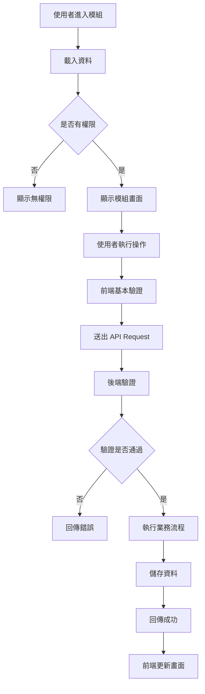
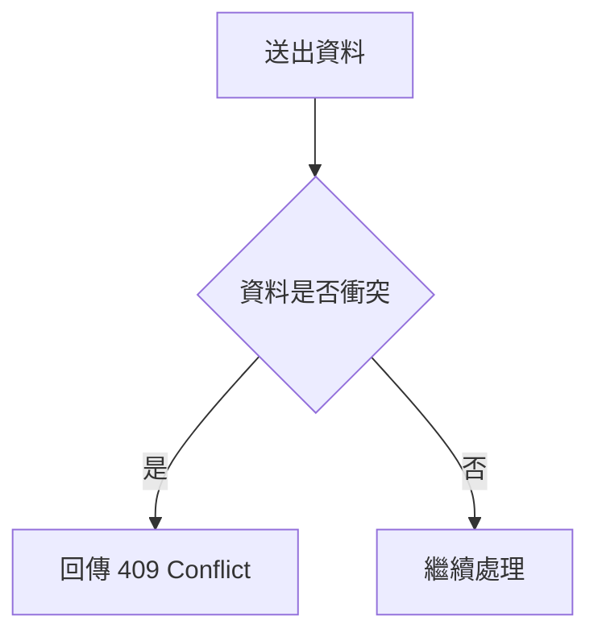

# {{MODULE_NAME}}

## Document Information

| 項目 | 內容 |
|---|---|
| Module | {{MODULE_NAME}} |
| Slug | `{{MODULE_SLUG}}` |
| Status | {{MODULE_STATUS}} |
| Owner | {{MODULE_OWNER}} |
| Created At | {{CREATED_DATE}} |
| Updated At | {{UPDATED_DATE}} |

可使用的狀態：

- Planned
- Analyzing
- Specifying
- Ready
- In Development
- Testing
- Completed
- Deferred

---

## 1. Overview

### 1.1 Purpose

{{MODULE_PURPOSE}}

### 1.2 Business Value

{{BUSINESS_VALUE}}

### 1.3 Background

{{MODULE_BACKGROUND}}

### 1.4 Target Users

- {{USER_ROLE_1}}
- {{USER_ROLE_2}}
- {{USER_ROLE_3}}

---

## 2. Scope

### 2.1 In Scope

本模組包含：

- {{IN_SCOPE_1}}
- {{IN_SCOPE_2}}
- {{IN_SCOPE_3}}
- {{IN_SCOPE_4}}

### 2.2 Out of Scope

本階段不包含：

- {{OUT_OF_SCOPE_1}}
- {{OUT_OF_SCOPE_2}}
- {{OUT_OF_SCOPE_3}}

### 2.3 Dependencies

依賴模組：

- {{DEPENDENCY_MODULE_1}}
- {{DEPENDENCY_MODULE_2}}

依賴服務：

- {{DEPENDENCY_SERVICE_1}}
- {{DEPENDENCY_SERVICE_2}}

---

## 3. Current System Analysis

### 3.1 Existing Behavior

目前系統行為：

{{CURRENT_BEHAVIOR}}

### 3.2 Existing Files

相關程式位置：

```text
{{RELATED_FILE_1}}
{{RELATED_FILE_2}}
{{RELATED_FILE_3}}
```

### 3.3 Existing Tables

相關資料表：

```text
{{TABLE_1}}
{{TABLE_2}}
{{TABLE_3}}
```

### 3.4 Existing Issues

- {{CURRENT_ISSUE_1}}
- {{CURRENT_ISSUE_2}}
- {{CURRENT_ISSUE_3}}

如為全新模組，可填：

```text
目前無既有功能。
```

---

## 4. Roles and Permissions

### 4.1 Roles

| Role | Description |
|---|---|
| {{ROLE_1}} | {{ROLE_DESCRIPTION_1}} |
| {{ROLE_2}} | {{ROLE_DESCRIPTION_2}} |
| {{ROLE_3}} | {{ROLE_DESCRIPTION_3}} |

### 4.2 Permission Matrix

| Action | {{ROLE_1}} | {{ROLE_2}} | {{ROLE_3}} |
|---|---:|---:|---:|
| View List | ✓ | ✓ | ✓ |
| View Detail | ✓ | ✓ | ✓ |
| Create | ✓ | ✓ | |
| Update | ✓ | ✓ | |
| Delete | ✓ | | |
| Export | ✓ | ✓ | |

權限判斷必須在 Backend 執行，不得只隱藏前端按鈕。

---

## 5. Functional Requirements

### FR-001：{{REQUIREMENT_TITLE_1}}

#### Description

{{REQUIREMENT_DESCRIPTION_1}}

#### Preconditions

- {{PRECONDITION_1}}
- {{PRECONDITION_2}}

#### Main Flow

1. {{MAIN_FLOW_STEP_1}}
2. {{MAIN_FLOW_STEP_2}}
3. {{MAIN_FLOW_STEP_3}}
4. {{MAIN_FLOW_STEP_4}}

#### Acceptance Criteria

```gherkin
Given {{GIVEN_CONDITION}}
When {{WHEN_ACTION}}
Then {{THEN_RESULT}}
```

#### Error Conditions

- {{ERROR_CONDITION_1}}
- {{ERROR_CONDITION_2}}

---

### FR-002：{{REQUIREMENT_TITLE_2}}

#### Description

{{REQUIREMENT_DESCRIPTION_2}}

#### Acceptance Criteria

```gherkin
Given {{GIVEN_CONDITION}}
When {{WHEN_ACTION}}
Then {{THEN_RESULT}}
```

---

### FR-003：{{REQUIREMENT_TITLE_3}}

#### Description

{{REQUIREMENT_DESCRIPTION_3}}

#### Acceptance Criteria

```gherkin
Given {{GIVEN_CONDITION}}
When {{WHEN_ACTION}}
Then {{THEN_RESULT}}
```

---

## 6. Business Rules

### BR-001：{{BUSINESS_RULE_TITLE_1}}

{{BUSINESS_RULE_DESCRIPTION_1}}

### BR-002：{{BUSINESS_RULE_TITLE_2}}

{{BUSINESS_RULE_DESCRIPTION_2}}

### BR-003：{{BUSINESS_RULE_TITLE_3}}

{{BUSINESS_RULE_DESCRIPTION_3}}

業務規則必須明確區分：

- 驗證規則
- 權限規則
- 狀態轉換規則
- 資料唯一性
- 時間限制
- 數量限制
- 跨模組限制

---

## 7. User Flow

### 7.1 Main Flow



### 7.2 Alternative Flow



---

## 8. Status Flow

若模組有狀態，請定義：

```text
draft
    ↓
pending
    ↓
approved
    ↓
completed
```

狀態轉換表：

| Current Status | Action | Next Status | Allowed Role |
|---|---|---|---|
| `draft` | Submit | `pending` | Creator |
| `pending` | Approve | `approved` | Manager |
| `pending` | Reject | `draft` | Manager |
| `approved` | Complete | `completed` | Staff |

不允許的狀態轉換必須由 Backend 阻擋。

---

## 9. Data Model

### 9.1 Related Tables

| Table | Purpose | Existing |
|---|---|---:|
| `{{TABLE_NAME_1}}` | {{TABLE_PURPOSE_1}} | Yes / No |
| `{{TABLE_NAME_2}}` | {{TABLE_PURPOSE_2}} | Yes / No |

### 9.2 Table Definition

#### `{{TABLE_NAME}}`

| Field | Type | Nullable | Default | Index | Description |
|---|---|---:|---|---:|---|
| `id` | bigint unsigned | No | | PK | Primary key |
| `{{FIELD_1}}` | {{TYPE_1}} | {{NULLABLE_1}} | {{DEFAULT_1}} | {{INDEX_1}} | {{DESCRIPTION_1}} |
| `{{FIELD_2}}` | {{TYPE_2}} | {{NULLABLE_2}} | {{DEFAULT_2}} | {{INDEX_2}} | {{DESCRIPTION_2}} |
| `created_at` | timestamp | Yes | null | | Created time |
| `updated_at` | timestamp | Yes | null | | Updated time |

### 9.3 Relationships

```text
{{MODEL_A}}
    hasMany
{{MODEL_B}}

{{MODEL_B}}
    belongsTo
{{MODEL_A}}
```

### 9.4 Indexes

建議 Index：

- `{{INDEX_FIELD_1}}`
- `{{INDEX_FIELD_2}}`
- Composite Index：`{{FIELD_A}}, {{FIELD_B}}`

### 9.5 Migration Considerations

- [ ] 是否已有大量資料
- [ ] 新欄位是否需 Nullable
- [ ] 是否需要 Default
- [ ] 是否需要資料回填
- [ ] 是否可 Rollback
- [ ] 是否會鎖表
- [ ] 是否需分階段上線

---

## 10. API Design

### 10.1 API Summary

| Method | Endpoint | Purpose | Permission |
|---|---|---|---|
| GET | `/api/{{RESOURCE}}` | List | `{{PERMISSION}}` |
| POST | `/api/{{RESOURCE}}` | Create | `{{PERMISSION}}` |
| GET | `/api/{{RESOURCE}}/{id}` | Detail | `{{PERMISSION}}` |
| PUT | `/api/{{RESOURCE}}/{id}` | Update | `{{PERMISSION}}` |
| DELETE | `/api/{{RESOURCE}}/{id}` | Delete | `{{PERMISSION}}` |

---

### 10.2 List API

```http
GET /api/{{RESOURCE}}
```

#### Query Parameters

| Parameter | Type | Required | Description |
|---|---|---:|---|
| `page` | integer | No | Page number |
| `per_page` | integer | No | Page size |
| `keyword` | string | No | Search keyword |
| `status` | string | No | Status filter |
| `sort` | string | No | Sort field |
| `direction` | string | No | `asc` or `desc` |

#### Success Response

```json
{
  "data": [
    {
      "id": 1,
      "{{FIELD_1}}": "{{VALUE_1}}",
      "{{FIELD_2}}": "{{VALUE_2}}"
    }
  ],
  "meta": {
    "current_page": 1,
    "per_page": 20,
    "total": 1
  },
  "message": "Success"
}
```

---

### 10.3 Create API

```http
POST /api/{{RESOURCE}}
```

#### Request

```json
{
  "{{FIELD_1}}": "{{VALUE_1}}",
  "{{FIELD_2}}": "{{VALUE_2}}"
}
```

#### Success Response

```json
{
  "data": {
    "id": 1,
    "{{FIELD_1}}": "{{VALUE_1}}",
    "{{FIELD_2}}": "{{VALUE_2}}"
  },
  "message": "Created successfully"
}
```

#### Status Code

```text
201 Created
```

---

### 10.4 Update API

```http
PUT /api/{{RESOURCE}}/{id}
```

#### Request

```json
{
  "{{FIELD_1}}": "{{NEW_VALUE}}"
}
```

#### Success Response

```json
{
  "data": {
    "id": 1,
    "{{FIELD_1}}": "{{NEW_VALUE}}"
  },
  "message": "Updated successfully"
}
```

---

### 10.5 Delete API

```http
DELETE /api/{{RESOURCE}}/{id}
```

#### Success Response

```json
{
  "data": null,
  "message": "Deleted successfully"
}
```

---

## 11. Validation

| Field | Rules | Message |
|---|---|---|
| `{{FIELD_1}}` | `required|string|max:255` | {{MESSAGE_1}} |
| `{{FIELD_2}}` | `nullable|integer|min:0` | {{MESSAGE_2}} |
| `{{FIELD_3}}` | `required|exists:{{TABLE}},id` | {{MESSAGE_3}} |

跨欄位規則：

- {{CROSS_FIELD_RULE_1}}
- {{CROSS_FIELD_RULE_2}}

業務驗證：

- {{BUSINESS_VALIDATION_1}}
- {{BUSINESS_VALIDATION_2}}

---

## 12. Error Handling

| Scenario | HTTP Status | Error Code | Message |
|---|---:|---|---|
| Unauthenticated | 401 | `UNAUTHENTICATED` | Unauthenticated |
| Forbidden | 403 | `FORBIDDEN` | Forbidden |
| Not Found | 404 | `NOT_FOUND` | Resource not found |
| Validation Failed | 422 | `VALIDATION_ERROR` | Validation failed |
| Conflict | 409 | `RESOURCE_CONFLICT` | Resource conflict |
| Internal Error | 500 | `INTERNAL_ERROR` | Internal server error |

錯誤 Response 建議：

```json
{
  "message": "Validation failed",
  "code": "VALIDATION_ERROR",
  "errors": {
    "{{FIELD}}": [
      "{{ERROR_MESSAGE}}"
    ]
  }
}
```

---

## 13. Backend Design

### 13.1 Planned Files

```text
api/routes/api.php

api/app/Http/Controllers/{{MODULE_NAME}}Controller.php

api/app/Http/Requests/{{MODULE_NAME}}/
├── Store{{MODEL_NAME}}Request.php
└── Update{{MODEL_NAME}}Request.php

api/app/Services/{{MODULE_NAME}}Service.php

api/app/Models/{{MODEL_NAME}}.php

api/app/Policies/{{MODEL_NAME}}Policy.php

api/app/Http/Resources/{{MODEL_NAME}}Resource.php

api/tests/Feature/{{MODULE_SLUG}}/
```

只有在專案既有架構需要時，才建立：

```text
api/app/Repositories/
api/app/Actions/
api/app/DTOs/
```

### 13.2 Transaction

以下操作必須在 Transaction 內：

- {{TRANSACTION_CASE_1}}
- {{TRANSACTION_CASE_2}}

### 13.3 Events and Jobs

可能事件：

```text
{{EVENT_NAME}}
```

可能 Queue Job：

```text
{{JOB_NAME}}
```

必須考慮：

- Idempotency
- Retry
- Timeout
- Failed Jobs
- Duplicate Dispatch

---

## 14. Frontend Design

### 14.1 Routes

| Route | Page | Permission |
|---|---|---|
| `/{{MODULE_ROUTE}}` | List Page | {{PERMISSION}} |
| `/{{MODULE_ROUTE}}/create` | Create Page | {{PERMISSION}} |
| `/{{MODULE_ROUTE}}/:id` | Detail Page | {{PERMISSION}} |
| `/{{MODULE_ROUTE}}/:id/edit` | Edit Page | {{PERMISSION}} |

### 14.2 Planned Structure

```text
web/src/features/{{MODULE_SLUG}}/
├── api/
│   ├── {{MODULE_SLUG}}.api.ts
│   └── {{MODULE_SLUG}}.types.ts
│
├── components/
│   ├── {{MODULE_NAME}}Filter.tsx
│   ├── {{MODULE_NAME}}Table.tsx
│   ├── {{MODULE_NAME}}Form.tsx
│   └── {{MODULE_NAME}}Modal.tsx
│
├── hooks/
│   └── use{{MODULE_NAME}}.ts
│
├── pages/
│   ├── {{MODULE_NAME}}ListPage.tsx
│   ├── {{MODULE_NAME}}CreatePage.tsx
│   ├── {{MODULE_NAME}}DetailPage.tsx
│   └── {{MODULE_NAME}}EditPage.tsx
│
├── schemas/
│   └── {{MODULE_SLUG}}.schema.ts
│
└── types/
    └── index.ts
```

### 14.3 UI States

每個主要畫面需處理：

- Loading
- Empty
- Success
- Error
- Forbidden
- Validation Error

### 14.4 Page Requirements

#### List Page

- Search
- Filter
- Pagination
- Sort
- Empty State
- Loading State
- Error State

#### Form Page

- Default Values
- Validation
- Submit Loading
- Submit Error
- Success Feedback
- Unsaved Changes Warning

---

## 15. Security

本模組必須檢查：

- [ ] Authentication
- [ ] Authorization
- [ ] Ownership
- [ ] Request Validation
- [ ] Mass Assignment
- [ ] SQL Injection
- [ ] Sensitive Data Exposure
- [ ] File Upload Validation
- [ ] Audit Log
- [ ] Rate Limiting

敏感欄位：

```text
{{SENSITIVE_FIELD_1}}
{{SENSITIVE_FIELD_2}}
```

敏感欄位不得直接輸出至 Log。

---

## 16. Performance

需特別注意：

- {{PERFORMANCE_CONCERN_1}}
- {{PERFORMANCE_CONCERN_2}}

檢查項目：

- [ ] Pagination
- [ ] Eager Loading
- [ ] Index
- [ ] Query Count
- [ ] Cache
- [ ] Queue
- [ ] Large Payload
- [ ] Batch Processing

---

## 17. Audit and Logging

需要記錄：

- 建立者
- 修改者
- 刪除者
- 狀態異動
- 權限異動
- 重要業務操作
- 外部服務失敗

不得記錄：

- Password
- Access Token
- Secret
- 完整敏感個資
- 信用卡或其他機密資料

---

## 18. Test Plan

### 18.1 Backend Feature Tests

- [ ] List success
- [ ] List pagination
- [ ] Search success
- [ ] Filter success
- [ ] Create success
- [ ] Create validation failure
- [ ] Update success
- [ ] Update not found
- [ ] Delete success
- [ ] Unauthorized
- [ ] Forbidden
- [ ] Conflict
- [ ] Transaction rollback

### 18.2 Backend Unit Tests

- [ ] Business rule success
- [ ] Business rule failure
- [ ] Status transition
- [ ] Data transformation

### 18.3 Frontend Tests

- [ ] Page renders
- [ ] Loading state
- [ ] Empty state
- [ ] API error
- [ ] Validation error
- [ ] Submit success
- [ ] Submit failure
- [ ] Permission restriction

### 18.4 Manual Acceptance Test

| Case | Steps | Expected Result | Result |
|---|---|---|---|
| {{CASE_1}} | {{STEPS_1}} | {{EXPECTED_1}} | Pending |
| {{CASE_2}} | {{STEPS_2}} | {{EXPECTED_2}} | Pending |

---

## 19. Implementation Tasks

### Phase 1：Analysis

- [ ] 分析既有程式
- [ ] 確認資料表與欄位
- [ ] 確認使用者角色
- [ ] 確認權限
- [ ] 確認現有 API 格式
- [ ] 整理 Open Questions

### Phase 2：Specification

- [ ] 完成功能需求
- [ ] 完成流程圖
- [ ] 完成資料模型
- [ ] 完成 API 規格
- [ ] 完成測試計畫
- [ ] 確認規格

### Phase 3：Backend

- [ ] 建立 Migration
- [ ] 建立 Model
- [ ] 建立 Form Request
- [ ] 建立 Service
- [ ] 建立 Controller
- [ ] 建立 Policy
- [ ] 建立 API Resource
- [ ] 建立 Routes
- [ ] 建立 Backend Tests

### Phase 4：Frontend

- [ ] 建立 Types
- [ ] 建立 API Client
- [ ] 建立 Hooks
- [ ] 建立 List Page
- [ ] 建立 Form
- [ ] 建立 Detail Page
- [ ] 建立 Error States
- [ ] 建立 Frontend Tests

### Phase 5：Integration

- [ ] 前後端串接
- [ ] 權限驗證
- [ ] 錯誤格式驗證
- [ ] Loading / Empty / Error 驗證
- [ ] Browser Acceptance Test

### Phase 6：Completion

- [ ] 執行完整測試
- [ ] 檢查 Query Performance
- [ ] 檢查 Security
- [ ] 更新 README
- [ ] 更新 PROJECT.md
- [ ] 更新 Decisions
- [ ] 完成驗收

---

## 20. Agent Task Assignment

| Task | Agent | Input | Output | Status |
|---|---|---|---|---|
| Existing code analysis | Analysis Agent | Source code | Analysis document | Planned |
| Database design | Database Agent | Requirements | Data model | Planned |
| API implementation | Backend Agent | API spec | Laravel code | Planned |
| UI implementation | Frontend Agent | UI spec | React code | Planned |
| Test creation | Testing Agent | Requirements | Automated tests | Planned |
| Review | Review Agent | Completed code | Review report | Planned |

每個 Agent 必須遵守本模組規格，不得自行擴大功能範圍。

---

## 21. Open Questions

- [ ] {{OPEN_QUESTION_1}}
- [ ] {{OPEN_QUESTION_2}}
- [ ] {{OPEN_QUESTION_3}}

每一個 Open Question 應記錄：

- 問題
- 影響範圍
- 可選方案
- 建議方案
- 最終決定

---

## 22. Assumptions

目前假設：

- {{ASSUMPTION_1}}
- {{ASSUMPTION_2}}

假設尚未確認前，不得當成正式需求。

---

## 23. Decisions

| Date | Decision | Alternatives | Reason | Impact |
|---|---|---|---|---|
| {{DATE}} | {{DECISION}} | {{ALTERNATIVES}} | {{REASON}} | {{IMPACT}} |

---

## 24. Risks

| Risk | Probability | Impact | Mitigation |
|---|---|---|---|
| {{RISK_1}} | Low / Medium / High | Low / Medium / High | {{MITIGATION_1}} |
| {{RISK_2}} | Low / Medium / High | Low / Medium / High | {{MITIGATION_2}} |

---

## 25. Definition of Done

本模組完成必須符合：

- [ ] 所有必要規格已確認
- [ ] Backend 功能完成
- [ ] Frontend 功能完成
- [ ] Authentication 完成
- [ ] Authorization 完成
- [ ] Validation 完成
- [ ] Error Handling 完成
- [ ] Migration 完成
- [ ] Backend Tests 通過
- [ ] Frontend Tests 通過
- [ ] Manual Acceptance Test 通過
- [ ] 無重大安全問題
- [ ] 無重大效能問題
- [ ] 文件已更新
- [ ] Open Questions 已處理或明確保留